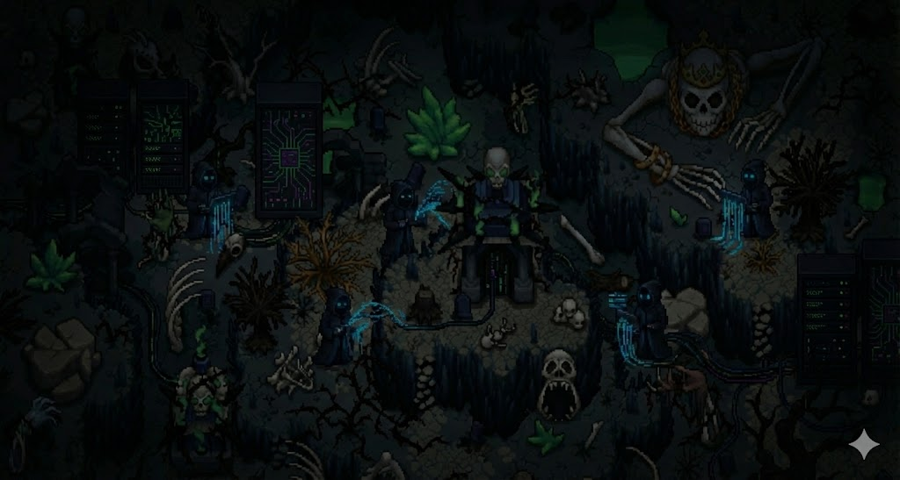
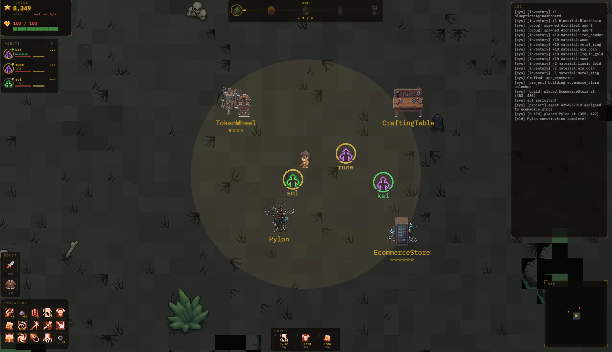

<p align="center">
  
</p>

<h1 align="center">IT'S TIME TO BUILD</h1>
<p align="center"><strong>The Experience</strong></p>

<p align="center">
  A dark-fantasy strategy game where AI agents write real code.<br/>
  Recruit autonomous workers, build a digital civilization, and survive the rogue uprising.
</p>

<p align="center">
  <code>v0.1.0 // ALPHA BUILD</code>
</p>

<p align="center">
  
</p>

<p align="center">
  
  
  
  
</p>

---

## What Is This?

**It's Time to Build** is a top-down pixel art strategy game that merges real-time combat, base management, and autonomous AI agents who generate actual React applications from scratch. You don't just tell your agents to "build a weather dashboard" — they spin up a real AI coding session, write TypeScript, and produce a working app. Choose your AI engine: **Claude Code** (Anthropic) or **Mistral Vibe** — selected on the title screen. The code is then graded by Claude AI, and your building's income depends on how good the code actually is.

Your goal: progress through five civilization phases — **Hut, Outpost, Village, Network, City** — by constructing buildings, managing your token economy, crafting equipment, and fending off waves of corrupted rogue agents that want to tear it all down.

## Key Features

### Real AI Agent Workers
- Choose your AI engine on the title screen: **Claude Code** or **Mistral Vibe**
- Agents spawn real CLI sessions to write actual React applications in real time
- 4 agent tiers (**Apprentice, Journeyman, Artisan, Architect**) with increasing capability
- **Claude Code**: Haiku 4.5 → Sonnet 4.6 → Opus 4.6 (uses existing machine auth, no API key needed)
- **Mistral Vibe**: Ministral 3B → Codestral → Devstral 2 (requires Mistral API key)
- Agents have morale, XP, levels, health, and a limited number of work turns
- Recruit **bound agents** scattered across the map by defeating their rogue guardians

### LLM-Powered Code Grading
- Completed buildings are evaluated by **Claude AI** with per-building-type rubrics
- **1-6 star ratings** based on code quality, functionality, and completeness
- Star ratings directly multiply building income (0.5x for 1 star up to 10x for 6 stars)
- Bring your own Anthropic API key — set it in-game via settings

### Real-Time Combat
- **Directional arc-based melee attacks** — positioning and facing matter
- **5 weapon types**: Shortsword, Greatsword, Staff, Crossbow (ranged projectiles), Torch
- **4 armor tiers**: Cloth, Leather, Chain, Plate — each with damage reduction and speed tradeoffs
- **7 rogue enemy types** with distinct AI behaviors:
  - **Swarm** — fast and numerous
  - **Assassin** — targets your highest-XP agent
  - **Corruptor** — slow, spreads corruption
  - **TokenDrain** — steals your tokens instead of dealing damage
  - **Looper, Mimic, Architect** — mid-to-boss tier threats
- Combat VFX: weapon swing arcs, floating damage numbers, death particles, screen shake, low-HP vignette

### Building & Progression
- **11 app buildings** across 4 tiers:
  | Tier | Buildings | Cost |
  |------|-----------|------|
  | 1 | Todo App, Calculator, Landing Page | 40-80 tokens |
  | 2 | Weather Dashboard, Chat App, Kanban Board | 100-200 tokens |
  | 3 | E-commerce Store, AI Image Generator, API Dashboard | 200-350 tokens |
  | 4 | Blockchain Explorer | 500 tokens |
- **Infrastructure**: Pylons (light sources), Compute Farms (passive income)
- **Home base**: Token Wheel (manual crank income) + Crafting Table
- 5 civilization phases with escalating difficulty and a **Cascade Event** endgame

### Crafting & Economy
- **6 materials** dropped by enemies and found in loot chests: Iron Powder, Wood, Metal Ring, Ore Coin, Liquid Gold, Mana
- **31 recipes** across Apps, Weapons, Armor, and Upgrades
- Buildings require **crafted blueprints** before they can be placed
- **Token economy**: balance passive building income against agent wages, construction costs, and recruitment fees
- **Upgrade tech tree** (12 upgrades across 4 tiers): Git Access, Web Search, Multi-Agent Coordination, Persistent Memory, and more

### Procedurally Generated World
- Simplex noise terrain generation (grass, stone, water, dirt)
- Chunk-based world with fog of war — light from Pylons and Torches reveals the map
- Scattered loot chests, bound agent camps, world objects (trees, ruins, crystals, graves)
- Real-time minimap with entity tracking

---

## Architecture

```
┌─────────────────────────────────────────────────────────────┐
│                        CLIENT                               │
│  TypeScript + React 19 + Pixi.js 8 + Vite 6               │
│                                                             │
│  ┌──────────┐  ┌───────────┐  ┌───────────┐  ┌──────────┐ │
│  │ Renderer │  │  React UI │  │ Network   │  │  Audio   │ │
│  │ (Pixi.js)│  │ (23+ HUDs)│  │ (MsgPack) │  │ Manager  │ │
│  └──────────┘  └───────────┘  └───────────┘  └──────────┘ │
└─────────────────────┬───────────────────────────────────────┘
                      │ WebSocket (MessagePack binary)
┌─────────────────────┴───────────────────────────────────────┐
│                        SERVER                               │
│  Rust + Tokio + hecs ECS                                   │
│                                                             │
│  ┌──────────┐  ┌───────────┐  ┌───────────┐  ┌──────────┐ │
│  │  ECS     │  │ Game Loop │  │ Vibe CLI  │  │ Grading  │ │
│  │ Systems  │  │  (20 Hz)  │  │ Sessions  │  │ (Claude) │ │
│  └──────────┘  └───────────┘  └───────────┘  └──────────┘ │
│                                                             │
│  Systems: Combat · Economy · Spawn · Progression ·          │
│           Building · Agent Tick · Rogue AI · Fog of War     │
└─────────────────────────────────────────────────────────────┘
```

### Server (Rust)
- **20 Hz game loop** with deterministic tick-based simulation
- **hecs ECS** for entity-component-system architecture
- **10+ game systems**: combat, economy, spawn, progression, building, agent tick, rogue AI, fog of war, projectiles, and more
- **Tokio async runtime** for WebSocket networking + Vibe CLI session management
- **Procedural generation** via Simplex noise with seeded randomness

### Client (TypeScript)
- **Pixi.js 8** for GPU-accelerated 2D rendering with chunked world and viewport culling
- **React 19** for all UI (23+ panels, modals, and HUD elements)
- **xterm.js** for in-game terminal overlay showing live agent output
- **MessagePack** binary serialization for efficient network sync
- **Combat VFX system** with particles, screen shake, and damage numbers

---

## Project Structure

```
its-time-to-build-game/
├── client/                         # Frontend application
│   ├── src/
│   │   ├── main.tsx               # Entry point, Pixi.js + React bootstrap
│   │   ├── renderer/              # Pixi.js rendering (world, entities, lighting, VFX)
│   │   ├── ui/                    # React UI components
│   │   │   ├── title-screen/      # Title screen + settings + particles
│   │   │   ├── hud.ts             # Core HUD (health, tokens, phase)
│   │   │   ├── agents-hud.ts      # Agent management sidebar
│   │   │   ├── building-toolbar.ts # Building selection toolbar
│   │   │   ├── crafting-modal.ts  # 3-tab crafting interface
│   │   │   ├── inventory-hud.ts   # Player inventory
│   │   │   ├── equipment-hud.ts   # Weapon/armor equipment
│   │   │   └── ...                # 15+ more UI components
│   │   ├── network/               # WebSocket + MessagePack protocol
│   │   ├── data/                  # Game data (buildings, crafting, upgrades)
│   │   └── audio/                 # Audio management
│   ├── public/                    # Static assets (sprites, audio, blueprints)
│   └── package.json
│
├── server/                         # Backend game server
│   ├── src/
│   │   ├── main.rs                # Server entry, 20 Hz game loop, WebSocket
│   │   ├── protocol.rs            # Network message types
│   │   ├── ecs/
│   │   │   ├── components.rs      # All ECS component definitions
│   │   │   └── systems/           # Game systems (combat, economy, spawn, etc.)
│   │   ├── game/                  # Game logic (agents, buildings, progression, upgrades)
│   │   ├── ai/                    # Rogue enemy AI behaviors
│   │   ├── network/               # WebSocket server
│   │   ├── vibe/                  # AI CLI session management (Claude Code + Mistral Vibe)
│   │   ├── project/               # React app scaffolding per building
│   │   └── grading/               # Claude API code evaluation
│   └── Cargo.toml
│
├── assets/                         # Game art, audio, icons
│   ├── Free-Undead-Tileset-Top-Down-Pixel-Art/
│   ├── icons/                     # Weapon, armor, enemy icons
│   ├── audio/
│   └── splash_screens/
│
├── buildings_manifest.json         # Building type definitions
└── docs/plans/                     # Design documents
```

---

## Getting Started

### Prerequisites

- **Node.js** 18+ (for the client)
- **Rust** 1.70+ with Cargo (for the server)
- **One of the following AI backends:**
  - **Claude Code CLI** — uses your existing `claude` login (no API key needed)
  - **Mistral Vibe CLI** + **Mistral API Key** — set in-game or via environment
- **Anthropic API Key** (optional — enables LLM code grading for star ratings)

### Environment Setup (optional)

If using **Mistral Vibe**, create a `.env` file in the `server/` directory:

```env
MISTRAL_API_KEY=your_mistral_api_key_here
```

For code grading, add your Anthropic key (or set it in-game via settings):

```env
ANTHROPIC_API_KEY=your_anthropic_api_key_here
```

If using **Claude Code**, no environment setup is needed — it uses your existing CLI authentication.

### Running the Game

**One command:**

```bash
./run.sh
```

This starts both the server (`ws://localhost:9001`) and client (`http://localhost:5173`).

**Or start them separately:**

```bash
# Terminal 1 — Server
cd server && cargo run

# Terminal 2 — Client
cd client && npm install && npm run dev
```

On first launch, you'll be prompted to:
1. **Choose your AI engine** (Claude Code or Mistral Vibe)
2. **Select a project directory** — where agent-generated React apps will be scaffolded

### Building for Production

```bash
# Client
cd client
npm run build

# Server
cd server
cargo build --release
```

---

## How to Play

### Controls

| Key | Action |
|-----|--------|
| `W` `A` `S` `D` | Move |
| `Left Click` | Attack (direction based on cursor) |
| `1`-`9` | Select hotbar slot |
| `B` | Open build menu |
| `C` | Open crafting table |
| `U` | Open upgrade tree |
| `I` | Open inventory |
| `E` | Interact (chests, wheel, crafting table) |
| `G` | Open grimoire (log) |
| `M` | Toggle minimap |
| `Tab` | Toggle agent panel |
| `T` | Toggle terminal overlay |

### Gameplay Loop

1. **Crank the Token Wheel** at your home base for starting income
2. **Defeat rogue enemies** to collect materials and bounty tokens
3. **Loot chests** scattered across the map for crafting materials
4. **Craft blueprints** at the Crafting Table to unlock building types
5. **Craft weapons and armor** to improve your combat capability
6. **Recruit agents** from the sidebar or find bound agents on the map
7. **Place buildings** and assign agents to construct them — they write real code
8. **Grade completed buildings** with Claude AI for star rating income bonuses
9. **Research upgrades** to enhance agent capabilities
10. **Progress through phases**: Hut → Outpost → Village → Network → City
11. **Survive the Cascade** — a final wave event triggered at the City phase

---

## Game Systems Deep Dive

### Agent Lifecycle

```
Idle → Walking → Building (Vibe CLI) → Idle
                      ↓
                  Erroring → (token burn)
                      ↓
               Unresponsive → (revive for tokens)
```

Agents earn XP from completed buildings. Higher-tier agents use more powerful AI models but cost more in wages. Agents at home base can be set to **Dormant** to avoid wage costs.

### Economy Balance

| Income | Expense |
|--------|---------|
| Building passive income (base × grade multiplier) | Agent wages (tier-based, per tick) |
| Token wheel cranking | Building construction cost |
| Enemy bounties (5-50 tokens) | Agent recruitment (20-400 tokens) |
| | Agent revival (15-300 tokens) |
| | Upgrade crafting (75-800 tokens) |

### Civilization Phases

| Phase | Requirement | What Changes |
|-------|------------|--------------|
| **Hut** | Starting phase | Basic enemies |
| **Outpost** | 2+ Tier 1 buildings + Pylon | Stronger rogues spawn |
| **Village** | 2+ Tier 2 buildings | Assassins and Corruptors appear |
| **Network** | 2+ Tier 3 buildings | TokenDrain enemies, higher spawn rates |
| **City** | 2+ Tier 4 buildings | **Cascade Event**: 10 waves of enemies |

### Upgrade Tech Tree

```
Tier 1 (Foundations)          Tier 2 (Tooling)
├── Expanded Context Window   ├── Git Access
├── Verbose Logging           ├── Web Search
└── Token Compression         ├── File System Access
                              └── Crank Assignment

Tier 3 (Infrastructure)      Tier 4 (Late Game)
├── Multi-Agent Coordination  ├── Agent Spawning
├── Persistent Memory         ├── Distributed Compute
└── Autonomous Scouting       └── Alignment Protocols
```

---

## Technical Highlights

- **Real code generation**: Agents don't fake it — they run actual AI CLI sessions (Claude Code or Mistral Vibe) via PTY to generate React apps
- **ECS architecture**: hecs enables clean separation of game data and logic with efficient queries
- **Binary protocol**: MessagePack serialization keeps network traffic compact at 20 Hz tick rate
- **Deterministic world gen**: Simplex noise with seeds means the same world every time
- **Hybrid rendering**: Pixi.js handles the game world while React manages all UI overlays
- **Async everything**: Tokio powers both the WebSocket server and Vibe CLI session management concurrently

---

## Art & Audio Credits

- **Tileset**: [Free Undead Tileset — Top-Down Pixel Art](https://opengameart.org/)
- **UI Font**: IBM Plex Mono
- **Audio**: Ambient title and gameplay tracks, UI click SFX

---

## Built With

<p align="center">
  <a href="https://github.com/its-maestro-baby/maestro"><strong>Maestro</strong></a> — AI-native development orchestration
</p>

---

<p align="center">
  <sub><code>// It's time to build.</code></sub>
</p>
